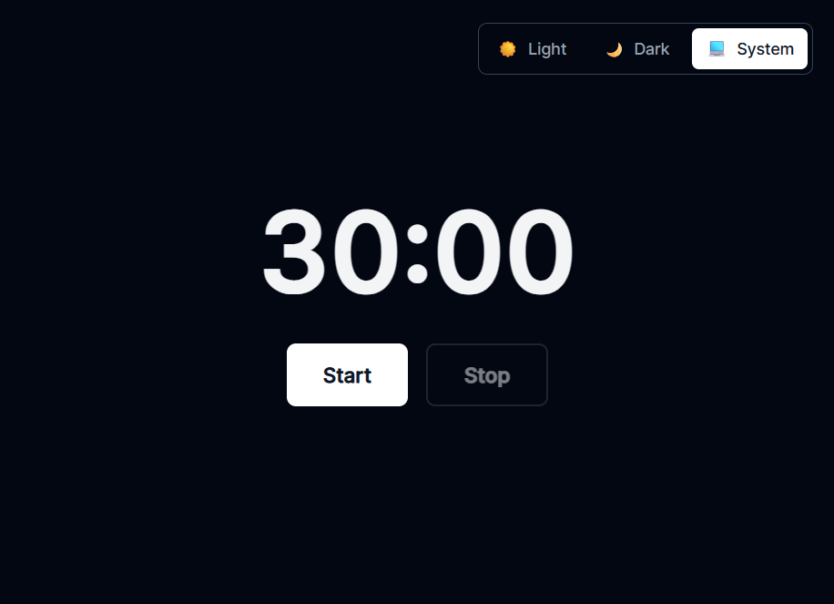

# 🍅 zentick

A minimal Pomodoro timer that keeps running even when you switch tabs.

[](https://zentick.vercel.app)
[](./LICENSE)

## ✨ Features

- ⏱️ 30-minute Pomodoro timer
- ⏯️ Start/Pause/Resume/Stop controls
- 🔔 Sound notification on completion
- 🌓 Theme toggle (light/dark/system)
- 🔄 **Background-safe** — continues running in hidden tabs

## 🚀 [Try it live →](https://zentick.vercel.app)



## 🛠️ Tech Stack

- Vue 3 (Composition API) + TypeScript
- Tailwind CSS 4
- Vite 7
- Page Visibility API for background timer

## 📦 Development
```bash
npm install
npm run dev
npm run build
```

## 🎯 Why "background-safe"?

Most browser timers slow down in hidden tabs. Zentick uses deadline-based timing and Page Visibility API to stay accurate even when you're in another tab.

## 📄 License

MIT © [Vladyslav Dariev](https://github.com/zenv-dev)

---

⭐ If you find this useful, consider giving it a star!